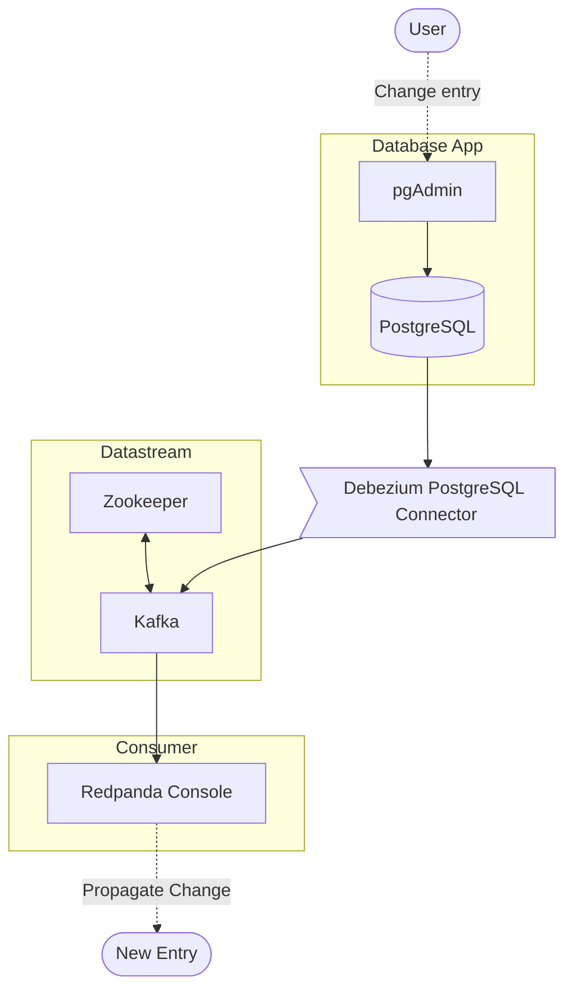

# Change Data Capture (CDC) with PostgreSQL and Kafka

TBD

## Architecture



## Usage

* Run the following command to start the docker containers:

```
docker-compose up
```

* Access pgAdmin at http://localhost:8080 and login with the following credentials
    * Email: dbuser@example.com
    * Password: dbpassword
    * Shop database credentials
        * Host: postgresql
        * Port: 5432
        * Username: dbuser
        * Password: dbpassword

* Access Redpanda console at http://localhost:8081
    * Products Update Topic: http://localhost:8081/topics/product-updates.public.products?p=-1&s=50&o=-1#messages

Update an entry in the products table and see the change in the Redpanda console.